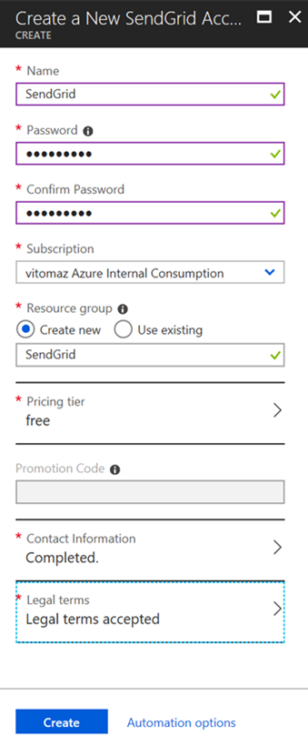
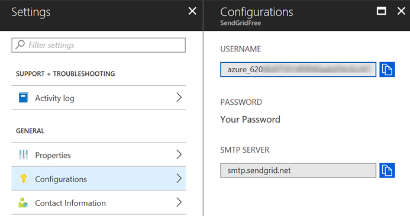
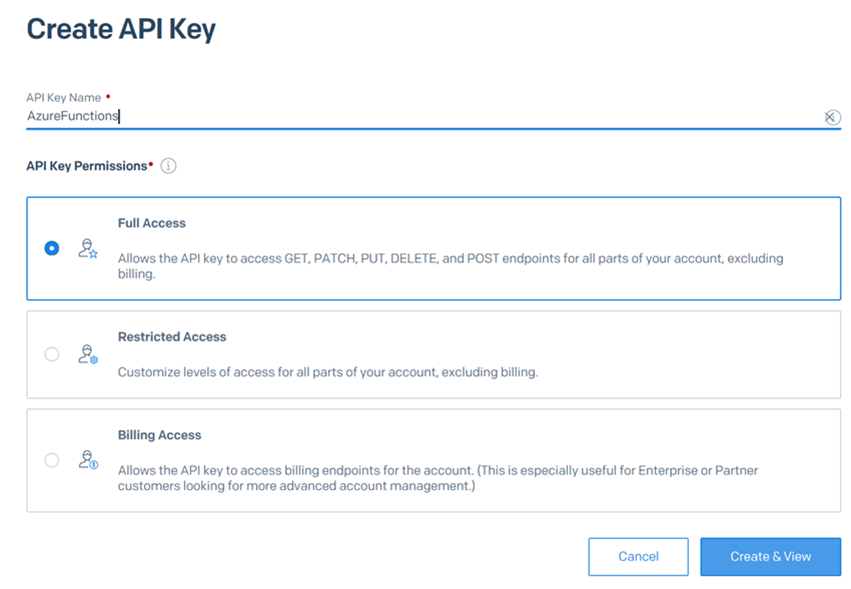
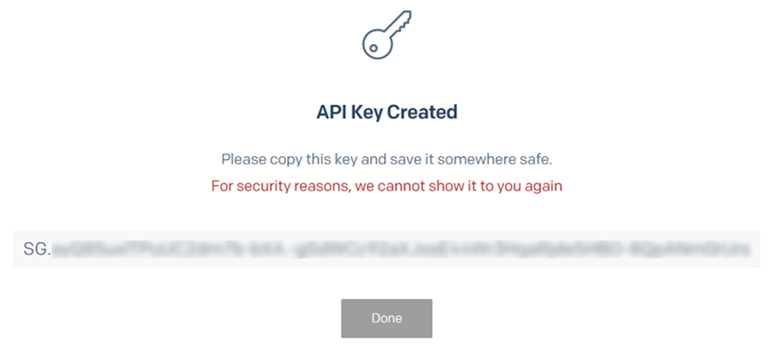

# SQL Data Sync Failure Monitor

A SendGrid API Key is necessary, please follow the instructions below in case you don't have one already.
After getting the SendGrid API Key you can use this button to deploy SQL Data Sync Failure Monitor in Azure:

### Prerequisite - SendGrid account
We need to create a new SendGrid Email Delivery resource in Azure:

You can pick the free pricing tier:

We need to configure an API key, please copy the user name from the SendGrid resource you just created:

Then navigate into https://sendgrid.com/
and Login with the copied username and password you chose when created the SendGrid resource.
Then navigate into API Keys 

Create an API Key and save the key for later usage:

