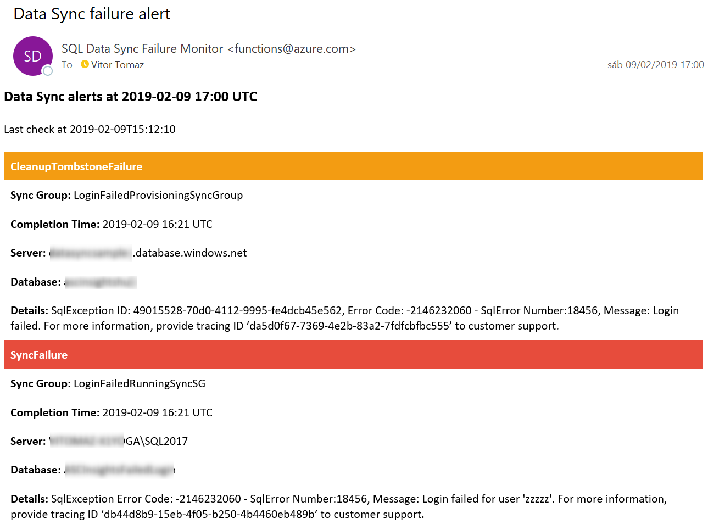
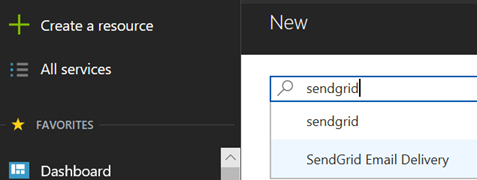
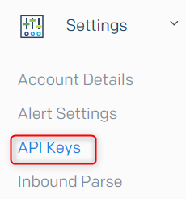

# SQL Data Sync Failure Monitor

This is a sample solution that consists of an Azure Function that will monitor the data sync history and send email alerts in case a sync failed since the last check.
This is not intended to be an example of programming best practices or Azure Functions architecture best practices, the goal is to have a simple solution to raise alerts on data sync failures.

A SendGrid API Key is necessary, please follow the instructions below in case you don't have one already.
After getting the SendGrid API Key you can use this button to deploy SQL Data Sync Failure Monitor in Azure:

 
 
 

### Prerequisite - SendGrid account

1. **We need to create a new SendGrid Email Delivery resource in Azure:**

2. **You can pick the free pricing tier:**

3. **We need to configure an API key, please copy the user name from the SendGrid resource you just created:**

4. **Then navigate into https://sendgrid.com/**
**and Login with the copied username and password you chose when created the SendGrid resource.**
**Then navigate into API Keys**

6. **Create an API Key and save the key for later usage:**

